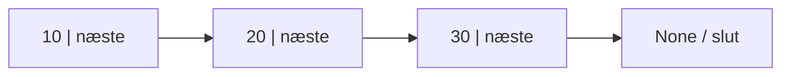
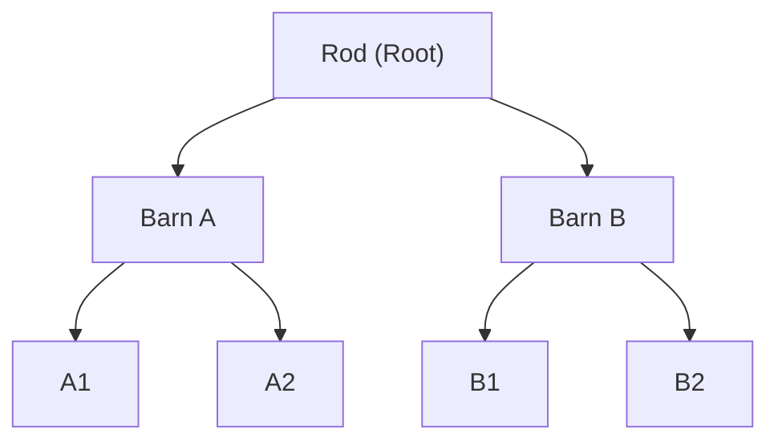
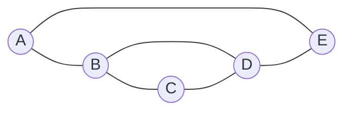
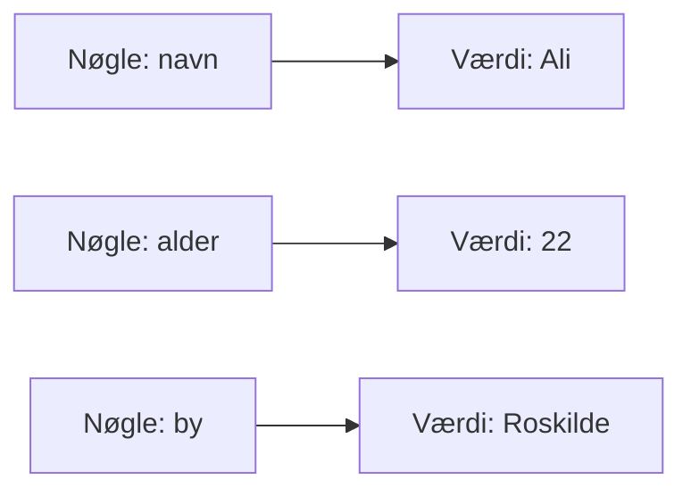

# Datastrukturer (Data Structures) – Visuel forklaring

## Hvad er en datastruktur?

En **datastruktur** er en måde at organisere og gemme data i et computerprogram, så vi nemt kan **finde, tilføje, ændre og slette** oplysninger.

Forestil dig, at vi har tallene `10, 20, 30, 40`. Vi kan organisere dem på flere måder, afhængigt af hvad programmet skal gøre.

---

## 1. Array – En række af elementer

Et **array** gemmer elementer i en bestemt rækkefølge. Hvert element har et **indeks**, som typisk starter ved `0`.

### Visuelt eksempel

| Indeks | 0 | 1 | 2 | 3 |
|:---:|:---:|:---:|:---:|:---:|
| Værdi | **10** | **20** | **30** | **40** |

**Python-eksempel:**

```python
karakterer = [10, 20, 30, 40]
print(karakterer[2])  # Output: 30
```

> **Bemærk:** Python-listen minder om et dynamisk array. Et traditionelt array har ofte en fast størrelse, men Python-lister kan vokse og blive mindre.

**Anvendelse:** Karakterer, sensormålinger og lister over produkter.

---

## 2. Linked List – Sammenkædet liste

En **linked list** består af elementer, der kaldes **noder**. Hver node indeholder en værdi og en reference til den næste node.

### Visuelt eksempel



- `10`, `20` og `30` er data i hver sin node.
- Pilene viser referencerne til den næste node.
- `None` betyder, at listen slutter.

**Anvendelse:** Strukturer, hvor man ofte indsætter eller fjerner noder, når man allerede har en reference til det relevante sted.

> **Vigtigt:** I modsætning til et array kan man normalt ikke slå et vilkårligt element op direkte efter indeks uden først at følge forbindelserne.

---

## 3. Stack – Stak (LIFO)

En **stack** fungerer som en stak tallerkener: Den tallerken, du lægger øverst, tager du først.

**LIFO = Last In, First Out (sidste ind, første ud).**

### Visuelt eksempel

```text
         TOP
    ┌───────────┐
    │    30     │  ← Fjernes først (Pop)
    ├───────────┤
    │    20     │
    ├───────────┤
    │    10     │
    └───────────┘
         BUND
```

- **Push:** Tilføj et element øverst.
- **Pop:** Fjern elementet øverst.

**Python-eksempel:**

```python
stack = [10, 20]
stack.append(30)     # Push: [10, 20, 30]
sidste = stack.pop()  # Pop: 30
print(sidste)         # Output: 30
```

**Anvendelse:** Undo-funktioner, funktionskald og backtracking.

---

## 4. Queue – Kø (FIFO)

En **queue** fungerer som en kø i et supermarked: Den første person i køen bliver betjent først.

**FIFO = First In, First Out (første ind, første ud).**

### Visuelt eksempel

```mermaid
flowchart LR
    U["Ud: Dequeue"] <-- A["10 – først"]
    A --- B["20"]
    B --- C["30 – sidst"]
    C <-- I["Ind: Enqueue"]
```

Når vi fjerner et element, fjernes `10` først. Når vi tilføjer `40`, sættes det bagerst.

**Python-eksempel:**

```python
from collections import deque

koe = deque([10, 20, 30])
koe.append(40)          # Enqueue: tilføj bagerst
foerste = koe.popleft() # Dequeue: fjern forrest
print(foerste)          # Output: 10
```

**Anvendelse:** Printerkøer, kundeservice og opgavebehandling.

---

## 5. Tree – Træstruktur

Et **tree** (træ) er en hierarkisk datastruktur. Den øverste node kaldes **roden (root)**, og noder under den kaldes **børn (children)**.

### Visuelt eksempel



**Anvendelse:** Mapper og undermapper, hierarkier og søgetræer.

**Eksempel:** En hovedmappe kan indeholde flere undermapper, som igen kan indeholde filer.

---

## 6. Graph – Graf

En **graph** (graf) består af **noder (vertices)** og **forbindelser (edges)** mellem noderne.

I modsætning til et træ kan en graf indeholde cykler og flere mulige veje mellem noder.

### Visuelt eksempel



**Eksempel: Navigation**

- **Node:** En by.
- **Kant (edge):** En vej mellem to byer.
- **Vægt (weight):** Eksempelvis vejens afstand eller rejsetid.

**Anvendelse:** Google Maps, sociale netværk og computernetværk.

---

## 7. Hash Table – Nøgle og værdi

En **hash table** gemmer data som **nøgle → værdi**. En hashfunktion bruges til at finde det sted, hvor en nøgles værdi er gemt. Det giver ofte meget hurtigt opslag.

### Visuelt eksempel



**Python-eksempel med dictionary:**

```python
student = {
    "navn": "Ali",
    "alder": 22,
    "by": "Roskilde"
}

print(student["navn"])  # Output: Ali
```

> **Bemærk:** En Python `dict` bruger en hashbaseret struktur, men diagrammet ovenfor er en forenklet illustration af nøgle–værdi-par. Det viser ikke selve hashfunktionen.

**Anvendelse:** Hurtigt opslag af data ud fra en unik nøgle.

---

## Sammenligning af de syv datastrukturer

| Datastruktur | Hovedidé | Praktisk anvendelse |
|---|---|---|
| **Array** | Elementer med indeks | Sensormålinger |
| **Linked List** | Noder med referencer | Dynamiske sammenkædede data |
| **Stack** | Sidste ind, første ud (LIFO) | Undo |
| **Queue** | Første ind, første ud (FIFO) | Printerkø |
| **Tree** | Hierarki | Mapper og undermapper |
| **Graph** | Noder og forbindelser | Navigation og netværk |
| **Hash Table** | Nøgle → værdi | Hurtigt opslag |

---

## Quiz – Test din forståelse

**Spørgsmål 1:** Hvilken datastruktur bruges typisk til en Undo-funktion?

- A. Queue
- B. Stack
- C. Graph

**Spørgsmål 2:** Hvad passer bedst til en printerkø?

- A. Queue
- B. Tree
- C. Hash Table

**Spørgsmål 3:** Hvilken datastruktur passer til et netværk af veje?

- A. Array
- B. Stack
- C. Graph

<details>
<summary><strong>Vis svar og forklaring</strong></summary>

1. **B. Stack** – Den seneste handling fortrydes først (LIFO).
2. **A. Queue** – Det første printjob behandles først (FIFO).
3. **C. Graph** – Byer kan være noder, og veje kan være forbindelser.

</details>

---

## Det vigtigste at huske

Datastrukturer handler ikke kun om at gemme data. De handler om at **organisere data på den måde, der passer bedst til opgaven**.

En **stack** og en **queue** kan for eksempel indeholde præcis de samme tal, men de fjerner dem i **forskellig rækkefølge**.

**Tip til undervisning:** Prøv at tegne hver datastruktur på tavlen og lad de studerende forklare, hvilket element der bliver læst eller fjernet først.
