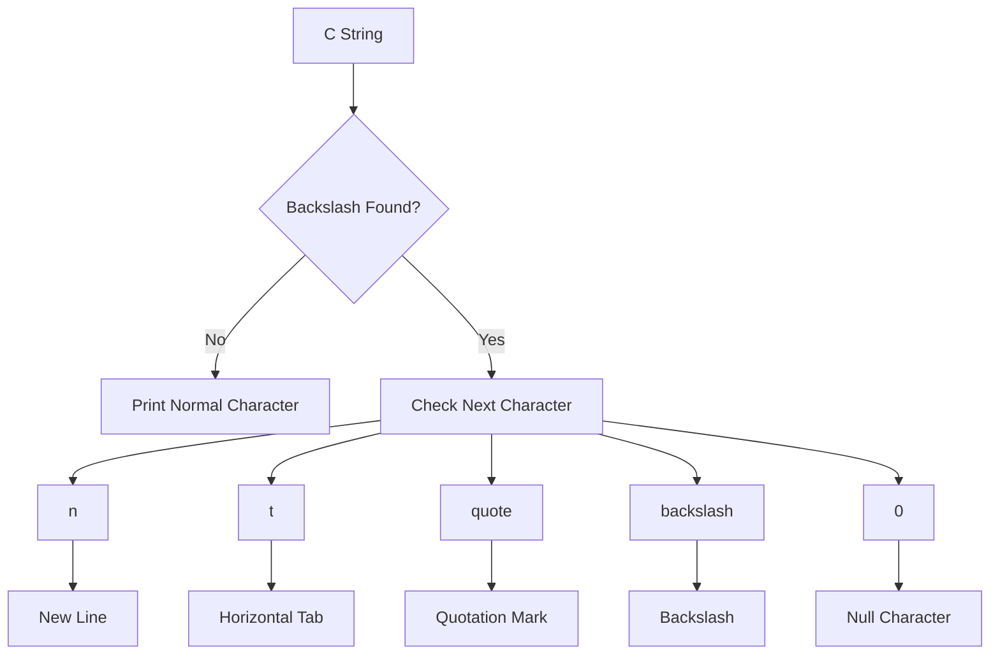

# 🌈 Escape Characters in C Programming

> 🎯 **Learning Goal:**  
> After completing this article, you should understand what escape characters are, why they are necessary, how they work, and how to use the most important escape sequences in C programs.

---

# 📚 Table of Contents

1. [Introduction](#-1-introduction)
2. [What Is an Escape Character?](#-2-what-is-an-escape-character)
3. [Why Do We Need Escape Characters?](#-3-why-do-we-need-escape-characters)
4. [Common Escape Sequences](#-4-common-escape-sequences)
5. [New Line `\n`](#-5-new-line-n)
6. [Horizontal Tab `\t`](#-6-horizontal-tab-t)
7. [Double Quote `\"`](#-7-double-quote-)
8. [Backslash `\\`](#-8-backslash-)
9. [Single Quote `\'`](#-9-single-quote-)
10. [Character vs String](#-10-character-vs-string)
11. [Null Character `\0`](#-11-null-character-0)
12. [`'0'` vs `'\0'`](#-12-0-vs-0)
13. [Carriage Return `\r`](#-13-carriage-return-r)
14. [Backspace `\b`](#-14-backspace-b)
15. [Alert `\a`](#-15-alert-a)
16. [Form Feed `\f`](#-16-form-feed-f)
17. [Vertical Tab `\v`](#-17-vertical-tab-v)
18. [Complete C Example](#-18-complete-c-example)
19. [How Escape Sequences Work](#-19-how-escape-sequences-work)
20. [Real-World Example](#-20-real-world-example)
21. [Common Mistakes](#-21-common-mistakes)
22. [Quick Reference](#-22-quick-reference)
23. [Classroom Exercises](#-23-classroom-exercises)
24. [Summary](#-24-summary)

---

# 🚀 1. Introduction

When we write a C program, we frequently display text using the `printf()` function.

For example:

```c
printf("Hello World");
```

Output:

```text
Hello World
```

But sometimes we want to perform special actions such as:

- Move to a new line
- Insert a tab
- Display quotation marks
- Display a backslash
- Represent the end of a string
- Move the cursor
- Produce an alert

Normal characters are not enough for these operations.

C therefore provides something called:

# ✨ Escape Sequences

---

# 🔍 2. What Is an Escape Character?

An **escape sequence** is a special combination of characters beginning with a:

```text
\
```

This symbol is called a:

> **Backslash**

The general structure is:

```text
Backslash + Special Character
```

For example:

```text
\n
```

contains:

```text
\  +  n
```

and means:

> Move to a **new line**.

---

## 🧠 Simple Definition

> An **escape sequence in C** is a combination beginning with a backslash `\` that represents a special character or special formatting instruction.

---

# 🎨 Visual Concept

```text
Normal Text
    │
    │
    ▼
"Hello World"

Special Formatting
    │
    │
    ▼
"Hello\nWorld"
       │
       ▼
    New Line
```

Output:

```text
Hello
World
```

---

# 🔧 3. Why Do We Need Escape Characters?

Consider the following statement:

```c
printf("Hello World");
```

This simply prints:

```text
Hello World
```

But suppose we want:

```text
Hello
World
```

We cannot simply press Enter inside a traditional C string like this:

```c
printf("Hello
World");
```

❌ This is not valid normal C string syntax.

Instead, we use:

```c
printf("Hello\nWorld");
```

The `\n` tells the program:

```text
Print Hello
     │
     ▼
Go to next line
     │
     ▼
Print World
```

---

# 🗂️ 4. Common Escape Sequences

The following are some of the most important escape sequences in C.

| Escape Sequence | Name | Meaning |
|---|---|---|
| `\n` | New Line | Move to next line |
| `\t` | Horizontal Tab | Insert tab space |
| `\\` | Backslash | Print `\` |
| `\"` | Double Quote | Print `"` |
| `\'` | Single Quote | Represent `'` |
| `\0` | Null Character | Marks end of C string |
| `\r` | Carriage Return | Move cursor to start of line |
| `\b` | Backspace | Move cursor backward |
| `\a` | Alert | Produce terminal alert |
| `\f` | Form Feed | Move to next page/form |
| `\v` | Vertical Tab | Vertical tab movement |

---

# 🟢 5. New Line `\n`

The most commonly used escape sequence in C is:

```text
\n
```

It means:

> **New Line**

It works similarly to pressing the **Enter key**.

---

## 💻 Example

```c
#include <stdio.h>

int main(void)
{
    printf("Hello\nWorld");

    return 0;
}
```

---

## 🖥️ Output

```text
Hello
World
```

---

## 🧩 Visualization

```text
"Hello\nWorld"

 Hello
   │
   ▼
  \n
   │
   ▼
New Line
   │
   ▼
 World
```

---

## Another Example

```c
printf("C Programming\nPython Programming\nJava Programming\n");
```

Output:

```text
C Programming
Python Programming
Java Programming
```

---

# 🔵 6. Horizontal Tab `\t`

The escape sequence:

```text
\t
```

means:

> **Horizontal Tab**

It creates horizontal spacing.

---

## 💻 Example

```c
printf("Name\tAge\tCity\n");
printf("Ali\t25\tCopenhagen\n");
```

Possible output:

```text
Name    Age     City
Ali     25      Copenhagen
```

---

## 📊 Using Tabs to Create Tables

```c
#include <stdio.h>

int main(void)
{
    printf("Product\tPrice\tQuantity\n");

    printf("Laptop\t8000\t2\n");
    printf("Mouse\t200\t5\n");
    printf("Keyboard\t500\t3\n");

    return 0;
}
```

Possible output:

```text
Product     Price   Quantity
Laptop      8000    2
Mouse       200     5
Keyboard    500     3
```

> 💡 `\t` is useful for simple terminal-based tables, although exact alignment depends on the text length and terminal tab width.

---

# 🟣 7. Double Quote `\"`

C strings use double quotation marks.

For example:

```c
printf("Hello");
```

Suppose we want to display:

```text
He said "Hello"
```

If we write:

```c
printf("He said "Hello"");
```

❌ The compiler becomes confused.

Why?

Because C thinks that the second quotation mark ends the string.

---

## Visualization

```text
"He said "Hello""
 ↑       ↑
Start    C thinks the string ends here
```

---

## ✅ Correct Solution

Use:

```text
\"
```

Example:

```c
printf("He said \"Hello\"");
```

Output:

```text
He said "Hello"
```

---

## Another Example

```c
printf("\"C Programming\" is interesting.");
```

Output:

```text
"C Programming" is interesting.
```

---

# 🟠 8. Backslash `\\`

The backslash:

```text
\
```

has a special meaning in C because it begins an escape sequence.

Therefore, if we actually want to print a backslash, we must write:

```text
\\
```

---

## 💻 Example

```c
printf("C:\\Users\\Student\\Documents");
```

Output:

```text
C:\Users\Student\Documents
```

---

## Visualization

```text
C Code          Output

\\              \

\\\\            \\
```

---

## 🪟 Windows Path Example

Suppose the actual Windows path is:

```text
C:\Programming\C\Projects
```

The C code should be:

```c
printf("C:\\Programming\\C\\Projects");
```

Output:

```text
C:\Programming\C\Projects
```

---

# 🟡 9. Single Quote `\'`

Characters in C normally use single quotation marks.

Example:

```c
char grade = 'A';
```

But what happens if we want the actual single quote character?

This is incorrect:

```c
char symbol = ''';
```

❌ The compiler cannot determine where the character begins and ends.

Instead, use:

```c
char symbol = '\'';
```

---

## 💻 Complete Example

```c
#include <stdio.h>

int main(void)
{
    char symbol = '\'';

    printf("%c\n", symbol);

    return 0;
}
```

Output:

```text
'
```

---

# 🔤 10. Character vs String

One of the most important beginner concepts in C is understanding the difference between a:

- Character
- String

---

## 🟦 Character

A character uses:

```text
Single quotes
```

Example:

```c
char letter = 'A';
```

---

## 🟩 String

A string uses:

```text
Double quotes
```

Example:

```c
char name[] = "Ali";
```

---

## Visual Comparison

```text
CHARACTER

'A'
 │
 ▼
One character


STRING

"Ali"
 │
 ├── A
 ├── l
 ├── i
 └── \0
```

---

## Comparison Table

| Concept | Example | Description |
|---|---|---|
| Character | `'A'` | One character |
| String | `"A"` | String containing one character + `\0` |
| Character | `'\n'` | New-line character |
| String | `"\n"` | String containing newline + `\0` |

---

# 🔴 11. Null Character `\0`

One of the most important escape sequences in C is:

```text
\0
```

It is called the:

# Null Character

Its numeric value is:

```text
0
```

C uses the null character to indicate:

> **The end of a string**

---

## Example

```c
char word[] = "CAT";
```

We see:

```text
C A T
```

But internally C stores:

```text
C A T \0
```

---

## 🧠 Memory Visualization

```text
Computer Memory

┌───────┬───────┬───────┬───────┐
│   C   │   A   │   T   │  \0   │
└───────┴───────┴───────┴───────┘
                            │
                            ▼
                       End of String
```

Therefore:

```text
"CAT"
```

contains three visible characters but requires storage for four characters:

```text
C
A
T
\0
```

---

# ⚠️ 12. `'0'` vs `'\0'`

This is a very common source of confusion.

These two values are **not the same**:

```c
'0'
```

and:

```c
'\0'
```

---

## `'0'`

This represents the visible character:

```text
0
```

In ASCII:

```text
'0' = 48
```

---

## `'\0'`

This represents:

```text
Null Character
```

Its numeric value is:

```text
0
```

---

## Comparison

| Code | Meaning | Typical numeric value |
|---|---|---:|
| `'0'` | Character zero | 48 |
| `'\0'` | Null character | 0 |

---

## Visual Explanation

```text
'0'
 │
 └────► Visible character: 0


'\0'
 │
 └────► Special null character
         used to terminate C strings
```

> ⚠️ Remember: `'0'` and `'\0'` are completely different.

---

# 🟤 13. Carriage Return `\r`

The escape sequence:

```text
\r
```

means:

> **Carriage Return**

It moves the cursor back toward the beginning of the current line.

---

## Example

```c
printf("Hello\rABC");
```

The exact visible result can depend on the terminal.

---

## Operating System Connection

New-line representations have historically differed between operating systems.

### Linux / Unix

```text
\n
```

### Traditional Windows Text Files

```text
\r\n
```

This means:

```text
\r = Carriage Return

\n = New Line
```

---

# ⬅️ 14. Backspace `\b`

The escape sequence:

```text
\b
```

means:

> **Backspace**

It moves the cursor backward.

Example:

```c
printf("ABC\bD");
```

Conceptually:

```text
A B C
    ↑
    │
   \b

Move cursor backward
```

The exact display may depend on the terminal.

---

# 🔔 15. Alert `\a`

The sequence:

```text
\a
```

means:

> **Alert**

Example:

```c
printf("\a");
```

Depending on the computer and terminal, it may:

- 🔊 Produce a beep
- 🔔 Produce an alert
- 💡 Flash the terminal
- ❌ Do nothing

Many modern terminals ignore the alert character.

---

# 📄 16. Form Feed `\f`

The escape sequence:

```text
\f
```

means:

> **Form Feed**

Historically, it was used with printers to move to the next page.

Example:

```c
printf("Page 1\fPage 2");
```

Today, `\f` is rarely used in normal terminal applications.

---

# ↕️ 17. Vertical Tab `\v`

The sequence:

```text
\v
```

means:

> **Vertical Tab**

Example:

```c
printf("Hello\vWorld");
```

Its behavior depends heavily on the terminal.

It is rarely used in modern applications.

---

# 💻 18. Complete C Example

The following program demonstrates several important escape sequences.

```c
#include <stdio.h>

int main(void)
{
    printf("====================================\n");
    printf("      ESCAPE SEQUENCES IN C\n");
    printf("====================================\n\n");

    printf("1. New Line:\\n\n");
    printf("Hello\nWorld\n\n");

    printf("2. Horizontal Tab:\\t\n");
    printf("Name\tAge\tCity\n");
    printf("Ali\t25\tCopenhagen\n\n");

    printf("3. Double Quotes:\n");
    printf("He said \"Hello World\"\n\n");

    printf("4. Backslash:\n");
    printf("C:\\Users\\Student\\Documents\n\n");

    printf("5. Single Quote:\n");
    printf("It\'s C programming!\n\n");

    printf("====================================\n");

    return 0;
}
```

---

## 🖥️ Possible Output

```text
====================================
      ESCAPE SEQUENCES IN C
====================================

1. New Line:\n
Hello
World

2. Horizontal Tab:\t
Name    Age     City
Ali     25      Copenhagen

3. Double Quotes:
He said "Hello World"

4. Backslash:
C:\Users\Student\Documents

5. Single Quote:
It's C programming!

====================================
```

---

# ⚙️ 19. How Escape Sequences Work

The general idea is:

```text
Backslash + Character
        │
        ▼
Escape Sequence
        │
        ▼
Special Meaning
```

For example:

```text
\ + n
  │
  ▼
 \n
  │
  ▼
New Line
```

Another example:

```text
\ + t
  │
  ▼
 \t
  │
  ▼
Horizontal Tab
```

---

## 🌈 Escape Sequence Flow Diagram



---

# 🤖 20. Real-World Example

Imagine we are displaying information from a robot system.

We want the terminal to show:

```text
===== ROBOT STATUS =====

Robot Name:     TurboPi
Battery:        85%
Distance:       45 cm
Status:         "Running"

Configuration:
C:\Robot\TurboPi\Config

========================
```

We can create it using:

```c
#include <stdio.h>

int main(void)
{
    printf("===== ROBOT STATUS =====\n\n");

    printf("Robot Name:\tTurboPi\n");
    printf("Battery:\t85%%\n");
    printf("Distance:\t45 cm\n");
    printf("Status:\t\t\"Running\"\n\n");

    printf("Configuration:\n");
    printf("C:\\Robot\\TurboPi\\Config\n\n");

    printf("========================\n");

    return 0;
}
```

---

# 🧠 Important Extra Concept: Printing `%`

Although `%` is not an escape sequence beginning with `\`, it has a special meaning inside `printf()`.

For example:

```c
printf("%d", age);
```

Therefore, if you want to print an actual percentage sign:

```text
%
```

you normally write:

```c
%%
```

Example:

```c
printf("Battery: 85%%");
```

Output:

```text
Battery: 85%
```

---

# ⚠️ 21. Common Mistakes

## ❌ Mistake 1 — Using Forward Slash

Wrong:

```c
printf("Hello/nWorld");
```

Output:

```text
Hello/nWorld
```

Correct:

```c
printf("Hello\nWorld");
```

Remember:

```text
/
```

is a forward slash.

But escape sequences use:

```text
\
```

the backslash.

---

## ❌ Mistake 2 — Windows Paths

Wrong:

```c
printf("C:\Users\Student");
```

The compiler may interpret combinations such as `\U` specially or report an error.

Correct:

```c
printf("C:\\Users\\Student");
```

---

## ❌ Mistake 3 — Quotation Marks Inside Strings

Wrong:

```c
printf("He said "Hello"");
```

Correct:

```c
printf("He said \"Hello\"");
```

---

## ❌ Mistake 4 — Confusing `'0'` and `'\0'`

Wrong assumption:

```text
'0' == '\0'
```

They are different.

```text
'0'  → character zero

'\0' → null character
```

---

## ❌ Mistake 5 — Confusing `\n` With `n`

These are different:

```text
n
```

is a normal letter.

```text
\n
```

is a special new-line character.

---

# 📋 22. Quick Reference

## ⭐ Most Important Escape Sequences for Beginners

```text
┌───────────┬────────────────────────┐
│ Sequence  │ Meaning                │
├───────────┼────────────────────────┤
│   \n      │ New Line               │
│   \t      │ Horizontal Tab         │
│   \\      │ Backslash              │
│   \"      │ Double Quote           │
│   \'      │ Single Quote           │
│   \0      │ Null Character         │
│   \r      │ Carriage Return        │
│   \b      │ Backspace              │
│   \a      │ Alert                  │
│   \f      │ Form Feed              │
│   \v      │ Vertical Tab           │
└───────────┴────────────────────────┘
```

---

# 🧠 Easy Memory Trick

Remember these letters:

```text
n → New line

t → Tab

0 → Null character
```

And special characters:

```text
\\ → Backslash

\" → Double quote

\' → Single quote
```

So:

```text
\n  → New Line

\t  → Tab

\\  → Backslash

\"  → Double Quote

\'  → Single Quote

\0  → Null Character
```

---

# 🏫 23. Classroom Exercises

## 🟢 Exercise 1 — Student Information

Write a C program that produces:

```text
=================================
       STUDENT INFORMATION
=================================

Name:           Ali
Age:            22
Course:         C Programming
Institution:    Zealand Academy

=================================
```

### Requirements

Use:

- `\n`
- `\t`

---

# 🟡 Exercise 2 — Quotation Marks

Create a program that displays:

```text
My teacher said:

"Practice programming every day."
```

### Requirements

Use:

- `\n`
- `\"`

---

# 🔵 Exercise 3 — Windows Path

Write a C program that produces:

```text
My project is stored here:

C:\Students\Programming\C\Project1
```

### Requirement

Use:

```text
\\
```

---

# 🟣 Exercise 4 — Programming Languages

Create the following output:

```text
Programming Languages

1. C
2. C++
3. Python
4. Java
```

Use several:

```text
\n
```

escape sequences.

---

# 🟠 Exercise 5 — Product Table

Create:

```text
Product         Price
Laptop          8000
Mouse           200
Keyboard        500
```

Use:

```text
\t
```

to organize the output.

---

# 🔴 Exercise 6 — Combined Escape Sequences

Write a program that produces:

```text
*********************************

Student:        Ali
Course:         "C Programming"
Folder:         C:\Courses\C

Message:
"Welcome to C Programming!"

*********************************
```

Try to use:

```text
\n
\t
\"
\\
```

---

# 🤖 Exercise 7 — Robot Information

Create a C program that prints:

```text
========== ROBOT STATUS ==========

Robot:          TurboPi
Battery:        95%
Distance:       35 cm
Camera:         "Active"
Motor:          "Running"

Project Folder:
C:\Robot\TurboPi

==================================
```

Use:

- `\n`
- `\t`
- `\"`
- `\\`

---

# 🎯 24. Summary

Escape sequences are essential when formatting text in C.

They allow us to represent special characters and control terminal output.

The most important ones to remember are:

| Sequence | Meaning |
|---|---|
| `\n` | New Line |
| `\t` | Tab |
| `\\` | Backslash |
| `\"` | Double Quote |
| `\'` | Single Quote |
| `\0` | Null Character |

---

# 🧩 Final Visual Summary

```text
                    ESCAPE SEQUENCES
                           │
          ┌────────────────┼─────────────────┐
          │                │                 │
          ▼                ▼                 ▼
      Formatting        Symbols          Strings
          │                │                 │
     ┌────┴────┐      ┌────┴────┐           │
     │         │      │         │           │
     ▼         ▼      ▼         ▼           ▼
    \n        \t     \"        \\          \0
     │         │      │         │           │
     ▼         ▼      ▼         ▼           ▼
 New Line     Tab    Quote    Backslash  End of String
```

---

# 🔑 Key Concept

> **An escape sequence in C begins with a backslash `\` and tells the compiler that the following character has a special meaning.**

For example:

```c
printf("Hello\nWorld");
```

can be understood as:

```text
Print "Hello"
      │
      ▼
Encounter \n
      │
      ▼
Move to next line
      │
      ▼
Print "World"
```

Final output:

```text
Hello
World
```

---

# 🚀 Where Escape Sequences Are Used

You will frequently encounter escape sequences when working with:

- 💻 Console applications
- 📁 File paths
- 📝 Text files
- 📊 Formatted output
- 🔤 Strings
- 🧠 Character arrays
- 🔌 Embedded systems
- 🤖 Robotics
- 🌐 Network programs
- 🐧 Linux programming
- 🍓 Raspberry Pi programming

Understanding escape sequences is therefore an important foundation for becoming comfortable with **C programming**.

---

## 🎓 Final Takeaway

When you see:

```text
\
```

inside a C string, think:

> 🚦 **"Something special is coming next."**

For example:

```text
\n → New line
\t → Tab
\" → "
\\ → \
\0 → End of string
```

Once this idea becomes familiar, reading and writing formatted C programs becomes much easier.
